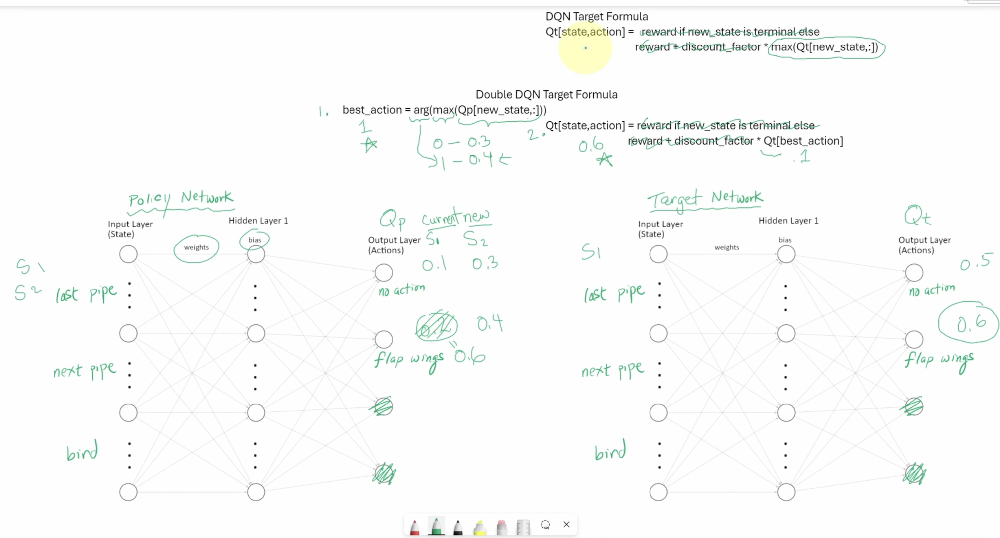
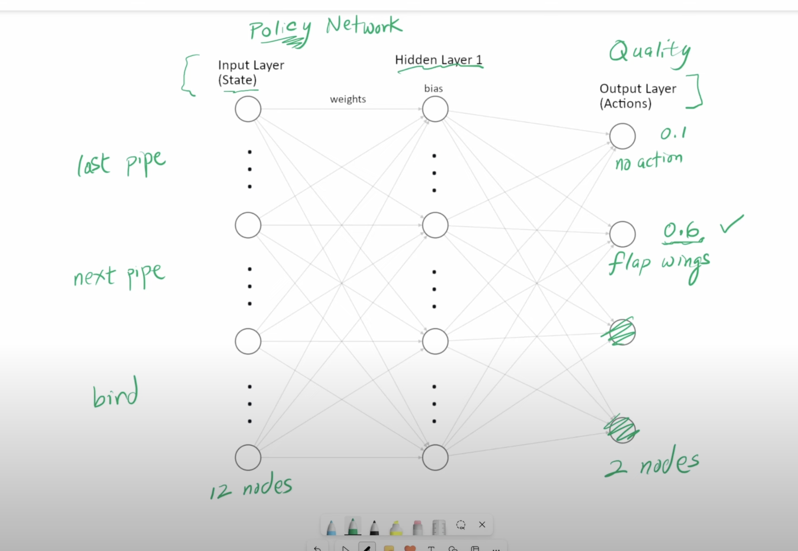
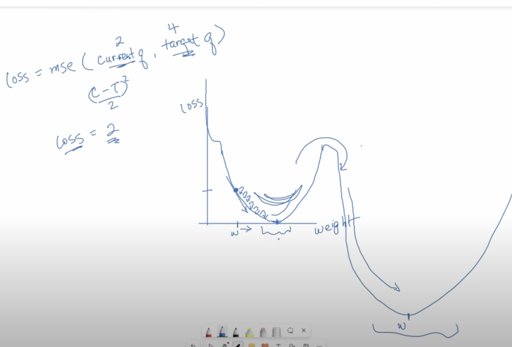

# Deep Q-Learning (DQN) Agent

This project implements a Deep Q-Learning (DQN) agent for reinforcement learning environments using Gymnasium. The agent is trained to play either **Flappy Bird** or **CartPole** using a deep neural network with optional **Dueling DQN** and **Double DQN** capabilities.

---

## 📂 Project Structure

- `agent.py` → Main script to train or test the DQN agent.
- `experience_replay.py` → Implements experience replay memory.
- `dqn.py` → Defines the neural network architecture for the agent.
- `hyperparameters.yml` → Configuration file with training parameters for different environments.
- `images/` → Contains visual explanations of the DQN concepts, including:
  - `double_DQN.png` → Illustration of the Double DQN method.
  - `policy_network_explanation.png` → Diagram of the policy network.
  - `optimizer_explanation.png` → Loss function and optimization visualization.

---

## 🚀 Getting Started

### **1️⃣ Setup the Virtual Environment**
```bash
python3 -m venv .venv
source .venv/bin/activate
```

### **2️⃣ Install Dependencies**
```bash
python3 -m pip install -r requirements.txt
```

### **3️⃣ Run the Agent**

#### **Training Mode** (Specify environment: `cartpole` or `flappybird`)
```bash
python3 agent.py cartpole --train
```
This will train the model in the specified environment and save the trained model.

#### **Evaluation Mode** (Without `--train`, it loads the saved model and plays the game)
```bash
python3 agent.py flappybird
```

#### **Exit Virtual Environment**
```bash
source deactivate
```

---

## 📜 Implementation Details

### **1️⃣ Experience Replay (`experience_replay.py`)**
Stores past experiences in a **Replay Memory** to sample mini-batches for training, improving stability by breaking correlation between consecutive samples.

### **2️⃣ Deep Q-Network (`dqn.py`)**
Defines a fully connected neural network that predicts Q-values for each action given a state. Supports:
- **Dueling DQN**: Separates value and advantage calculations.
- **Double DQN**: Uses a separate target network to reduce Q-value overestimation.

### **3️⃣ Hyperparameters (`hyperparameters.yml`)**
Defines environment-specific configurations such as learning rates, discount factors, and epsilon decay for exploration.


#### 🔧 Explanation of Each Parameter:
- **`env_id`**: The Gymnasium environment to be used (e.g., `CartPole-v1`, `FlappyBird-v0`).
- **`replay_memory_size`**: Maximum number of experiences stored in the replay buffer.
- **`mini_batch_size`**: Number of experiences sampled per training step.
- **`epsilon_init`**: Initial value for epsilon (ε) in the ε-greedy policy.
- **`epsilon_decay`**: Rate at which epsilon decays per step.
- **`epsilon_min`**: Minimum value epsilon can decay to.
- **`network_sync_rate`**: Number of steps between syncing the target network with the policy network.
- **`learning_rate_a`**: Learning rate for the Adam optimizer.
- **`discount_factor_g`**: Discount factor gamma (γ), determining the importance of future rewards.
- **`stop_on_reward`**: Training will stop if the cumulative reward in an episode reaches this value.
- **`fc1_nodes`**: Number of neurons in the first fully connected layer of the DQN.
- **`env_make_params`**: Optional dictionary to pass additional arguments to the environment (e.g., `use_lidar: False`).
- **`enable_double_dqn`**: Whether to use Double DQN (improves stability by reducing overestimation).
- **`enable_dueling_dqn`**: Whether to use Dueling DQN (improves learning by separating state value from action advantages).

---

## 📊 Understanding the Training Process

The **DQN training** process follows these steps:
1. The agent observes the current state of the environment.
2. It selects an action using an **ε-greedy strategy** (random action vs. best predicted action).
3. It receives a reward and observes the new state.
4. The experience is stored in the replay memory.
5. A random batch of experiences is sampled for training.
6. The model is trained using the **Mean Squared Error (MSE) loss**.
7. The target network is updated periodically to stabilize learning.

---

## 📷 Visual Explanations
The `images/` folder contains visual aids to understand the DQN architecture:
- **Double DQN Calculation (`double_DQN.png`)** → Explains how the Double DQN selects actions.

- **Policy Network (`policy_network_explanation.png`)** → Shows how states are processed to predict Q-values.

- **Optimization & Loss (`optimizer_explanation.png`)** → Illustrates loss calculation and backpropagation.


---

## 🔧 Future Improvements
- Implement **Prioritized Experience Replay** to improve learning efficiency.
- Add **Rainbow DQN features** such as distributional Q-learning.
- Extend support for more **Gymnasium environments**.

---

## 📝 License
This project is open-source and available for educational and research purposes.

---

### **📬 Contact**
For questions or contributions, feel free to reach out or submit a pull request!

🚀 **Happy Learning!** 🎮