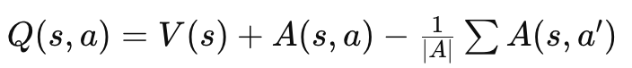

# Deep Q-Network (`dqn.py`)

This document provides an in-depth explanation of `dqn.py`, which defines the **Deep Q-Network (DQN)** used for reinforcement learning.

---

## 📜 Overview
The `dqn.py` file implements a **fully connected neural network** that serves as the **Q-value estimator** in a Deep Q-Learning (DQN) agent. It includes support for:

- **Standard DQN** – A deep neural network that predicts Q-values for each action given a state.
- **Dueling DQN** – Separates **state value estimation** from **advantage estimation** for better learning efficiency.

The network architecture allows the agent to interact with environments like **Flappy Bird** and **CartPole** by predicting the best possible actions given a state observation.

---

## 🚀 How It Works

### **1️⃣ Importing Dependencies**
```python
import flappy_bird_gymnasium
import gymnasium
import torch
from torch import nn
import torch.nn.functional as F
from collections import deque
import random
import itertools
import yaml
```
- Uses **PyTorch** to define the neural network.
- Loads **Gymnasium** environments for training and testing.
- Uses standard Python libraries (`random`, `deque`, `yaml`) for reinforcement learning utilities.

### **2️⃣ DQN Class Definition**
```python
class DQN(nn.Module):
    def __init__(self, state_dim, action_dim, hidden_dim=256, enable_dueling_dqn=True):
        super(DQN, self).__init__()
        self.enable_dueling_dqn = enable_dueling_dqn
```
- The **DQN class** inherits from `nn.Module`, making it a PyTorch-based neural network.
- Takes `state_dim` (size of the state space) and `action_dim` (number of possible actions).
- Has a configurable **hidden layer size** (`hidden_dim` = 256 by default).
- The `enable_dueling_dqn` flag toggles **Dueling DQN mode**.

### **3️⃣ Neural Network Architecture**
#### **First Hidden Layer**
```python
        self.fc1 = nn.Linear(state_dim, hidden_dim)
```
- Defines the **first fully connected (FC) layer** that takes the state representation as input.

#### **Dueling DQN Architecture (Optional)**
If **Dueling DQN** is enabled, the network splits into **two streams**:

##### **State-Value Estimation**
```python
        self.fc_value = nn.Linear(hidden_dim, 256)
        self.value = nn.Linear(256, 1)
```
- Estimates how **valuable a given state is** (`V(s)`).

##### **Advantage Function**
```python
        self.fc_advantages = nn.Linear(hidden_dim, 256)
        self.advantages = nn.Linear(256, action_dim)
```
- Computes **the advantage of each action** over others (`A(s, a)`).

##### **Standard DQN (if Dueling is Disabled)**
```python
        else:
            self.output = nn.Linear(hidden_dim, action_dim)
```
- If **Dueling DQN is disabled**, a single output layer directly predicts Q-values.

### **4️⃣ Forward Pass: Calculating Q-Values**
```python
def forward(self, x):
    x = F.relu(self.fc1(x))
```
- Applies **ReLU activation** to introduce non-linearity.
- If **Dueling DQN** is enabled:
```python
    if self.enable_dueling_dqn:
        v = F.relu(self.fc_value(x))
        V = self.value(v)
        a = F.relu(self.fc_advantages(x))
        A = self.advantages(a)
```
- **V(s)** is computed from the **Value stream**.
- **A(s, a)** is computed from the **Advantage stream**.

#### **Final Q-Value Calculation (Dueling DQN)**
```python
        Q = V + A - torch.mean(A, dim=1, keepdim=True)
```
- The Q-value is computed as: 
  - This ensures that the advantage values are normalized.

#### **Standard DQN Forward Pass**
```python
    else:
        Q = self.output(x)
    return Q
```
- If **Dueling DQN is disabled**, Q-values are directly taken from the final layer.

---

## 📊 Key Features

1. **Fully connected deep neural network** for Q-value estimation.
2. **Dueling DQN support** to improve learning efficiency.
3. **ReLU activation functions** for non-linearity.
4. **PyTorch-based implementation** for efficient training.

---

## 📷 Visual Explanation

The `images/` folder contains diagrams explaining the Q-network architecture:
- **Policy Network (`policy_network_explanation.png`)** → Shows how the input state is processed into Q-values.
- **Dueling DQN (`double_DQN.png`)** → Explains how state-value and advantage functions are computed.

---

## 🔧 Future Improvements
- Implement **Distributional Q-learning** for better uncertainty estimation.
- Add **Noisy Networks** for exploration instead of ε-greedy.
- Optimize **network depth and width** for better performance.

---

## 📝 License
This project is open-source and available for educational and research purposes.

🚀 **Happy Learning!** 🎮

